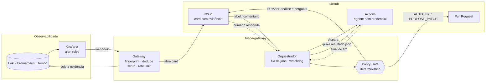

# GithubIssuesGateway

**Triagem automatizada de erros de produção com agente de IA sob controle determinístico.**

Um alerta do Grafana vira um card no GitHub Issues com a evidência já coletada. Um
agente de IA investiga o erro num runner isolado e, quando consegue, propõe teste e
correção. Um **Policy Gate determinístico** verifica os fatos por conta própria e decide
o que vira PR e o que volta para um humano — com a investigação documentada no card.


---

## Sumário

- [Por que existe](#por-que-existe)
- [Como funciona](#como-funciona)
- [Decisões de design](#decisões-de-design)
- [Policy Gate](#policy-gate)
- [Stack](#stack)
- [Começando](#começando)
- [Configuração](#configuração)
- [Runner no repositório monitorado](#runner-no-repositório-monitorado)
- [Operação](#operação)
- [Estrutura do projeto](#estrutura-do-projeto)
- [Documentação](#documentação)
- [Licença](#licença)

---

## Por que existe

Entre "o erro aconteceu" e "alguém entendeu o erro", quase todo o tempo vai em trabalho
mecânico: perceber o alerta, abrir o Grafana, correlacionar com o último deploy, abrir o
card, juntar logs e métricas. Este projeto automatiza essa parte e entrega ao time, em
minutos, um card com evidência, hipótese e — quando possível — um PR com teste.

Ele **não** é um "auto-fix de produção". O agente nunca é fonte de verdade: tudo que ele
afirma é verificado por código determinístico antes de chegar ao repositório.

---

## Como funciona



1. **Alerta.** O Grafana dispara o webhook. O gateway autentica, calcula o fingerprint
   do erro e deduplica: o mesmo defeito nunca vira dois cards.
2. **Evidência.** O gateway coleta logs do trace (Loki), spans (Tempo), métricas
   (Prometheus), deploys e commits recentes (GitHub), remove segredos e abre o card.
3. **Investigação.** O orquestrador dispara um workflow no GitHub Actions. O agente
   recebe o card e a evidência como dado não-confiável, investiga o código e escreve um
   `resultado.json` com hipótese, evidência a favor e contra, diff e teste.
4. **Verificação.** O orquestrador puxa o resultado. O Policy Gate clona o repositório,
   aplica **só o teste** e exige a suíte vermelha, aplica a correção e exige verde, mede
   o diff e confere allowlist e blast radius.
5. **Decisão.** Abre PR (`AUTO_FIX` com auto-merge, ou `PROPOSE_PATCH` para revisão) ou
   devolve ao humano (`HUMAN`) com a análise e a pergunta que destrava. A resposta
   humana no card dispara uma nova rodada, que retoma de onde parou.

---

## Decisões de design

| Princípio | Como se traduz no código |
|---|---|
| **O gate não acredita no agente** | Teste vermelho→verde, tamanho do diff e áreas tocadas são verificados rodando, nunca lidos do resultado |
| **Resultado puxado, nunca empurrado** | O runner só sinaliza o fim; o orquestrador busca o artefato com a própria credencial |
| **Runner sem credencial** | O agente não tem token do board nem permissão de push; quem publica é o orquestrador, depois do gate |
| **Evidência é dado hostil** | Log pode conter prompt injection; chega ao agente marcado como não-confiável e o gate é a fronteira de confiança |
| **Falha fechada** | Segredo ausente recusa o webhook; registro inválido mantém a versão anterior; caminho não mapeado é `CRITICO` |
| **Assíncrono de ponta a ponta** | Nenhum handler HTTP dispara runner ou roda teste: grava estado e responde `202` |
| **Adoção gradual** | `AUTO_FIX` nasce desligado; todo PR passa por revisão humana até haver dado que justifique o contrário |

---

## Policy Gate

Tabela de decisão avaliada em ordem; a primeira cláusula que casa decide.

| Resultado | Quando |
|---|---|
| `HUMAN` | incidente ativo, segunda tentativa no mesmo erro, sem proposta de diff, área crítica, fora da allowlist, migração/IaC/dependência/CI, teste não reproduz o erro ou suíte não passa |
| `PROPOSE_PATCH` | diff acima do limite do projeto ou severidade crítica — PR aguarda revisão |
| `AUTO_FIX` | todo o resto: allowlist, teste vermelho→verde e diff pequeno — PR com auto-merge se o CI passar |

Quando a decisão é `HUMAN`, o card recebe a hipótese, a evidência a favor e contra, a
cláusula que barrou e uma pergunta específica para o humano responder.

Detalhes em [§6 da arquitetura](docs/ARQUITETURA_TRIAGEM_AUTOMATIZADA.md#6-policy-gate).

---

## Stack

| Camada | Tecnologia |
|---|---|
| Linguagem e framework | Java 21, Spring Boot 3.5 (Web, Validation, Data JPA, Actuator) |
| Persistência | PostgreSQL em produção, H2 em desenvolvimento |
| Mapeamento | MapStruct com `unmappedTargetPolicy = ERROR` |
| Testes | JUnit 5, Mockito, AssertJ |
| Observabilidade | Grafana, Loki, Prometheus, Tempo, Micrometer |
| Board e runner | GitHub Issues, GitHub Actions, `anthropics/claude-code-action` |
| Empacotamento | Docker |

---

## Começando

### Pré-requisitos

- JDK 21
- Maven 3.9+
- Git (o Policy Gate clona o repositório monitorado para verificar a proposta)

### Rodar localmente

```bash
mvn test              # suíte completa
mvn spring-boot:run   # sobe com H2 em memória na porta 8080
```

Sem as credenciais configuradas a aplicação sobe, mas recusa os webhooks — falha
fechada por desenho.

### Docker

```bash
docker build -t triage-gateway .
docker run -p 8080:8080 --env-file triage.env triage-gateway
```

A imagem de runtime traz JDK, Maven, Node e Git, porque o próprio processo roda a suíte
de testes do projeto monitorado.

---

## Configuração

<details>
<summary><strong>Registro de escopo — <code>config/projetos.json</code></strong></summary>

<br>

Nem o gateway nem o orquestrador conhecem projeto por código. Tudo que varia por
projeto vem deste arquivo, recarregado periodicamente:

```jsonc
{
  "versao": "exemplo-1",
  "projetos": [
    {
      "projeto": "exemplo-api",
      "diretorio": "/opt/projetos/exemplo-api",
      "servicos": ["exemplo-api"],             // service_name emitido no log
      "pacotes_raiz": ["com.exemplo"],         // frame usado no fingerprint
      "repositorio": "exemplo/exemplo-api",
      "branch_base": "main",
      "comando_de_teste": ["mvn", "-B", "test"],
      "ambientes": ["producao"],
      "board": "exemplo/exemplo-api",          // onde o card é aberto
      "allowlist": ["src/main/java/**/parser/**"],
      "blast_radius": { "src/main/java/**/pagamento/**": "CRITICO" },
      "limites": { "diff_max_linhas": 50, "diff_max_arquivos": 3,
                   "cards_por_hora": 10, "jobs_por_hora": 10 },
      "ativo": true
    }
  ]
}
```

- JSON inválido é rejeitado inteiro e a última versão válida continua valendo.
- Serviço que não casa com nenhum projeto não gera card: vira métrica de log órfão.
- Caminho não classificado em `blast_radius` é tratado como `CRITICO`.
- Para carregar de uma URL (um bucket S3, por exemplo):
  `TRIAGE_REGISTRY_ORIGEM=HTTP TRIAGE_REGISTRY_URL=https://.../projetos.json`

</details>

<details>
<summary><strong>Variáveis de ambiente</strong></summary>

<br>

**Credenciais** — sem elas, o endpoint correspondente recusa tudo.

| Variável | Uso |
|---|---|
| `TRIAGE_GITHUB_TOKEN` | escrita no board, disparo do workflow, push da branch e abertura do PR |
| `TRIAGE_GITHUB_WEBHOOK_SECRET` | HMAC dos webhooks do board e da comunicação com o runner |
| `TRIAGE_GRAFANA_WEBHOOK_TOKEN` | credencial do contact point do Grafana (Bearer, ou senha do Basic) |
| `TRIAGE_GRAFANA_WEBHOOK_USUARIO` | usuário do Basic (padrão `grafana`) |

**Integrações**

| Variável | Padrão |
|---|---|
| `TRIAGE_URL_PUBLICA` | — (URL que o runner usa para buscar contexto e sinalizar o fim) |
| `TRIAGE_LOKI_URL` | `http://localhost:3100` |
| `TRIAGE_PROMETHEUS_URL` | `http://localhost:9090` |
| `TRIAGE_TEMPO_URL` | `http://localhost:3200` |
| `TRIAGE_GRAFANA_URL` | — |
| `TRIAGE_GITHUB_WORKFLOW` | `triage-runner.yml` |

**Banco**

| Variável | Padrão |
|---|---|
| `TRIAGE_DB_URL` | H2 em memória |
| `TRIAGE_DB_USER` / `TRIAGE_DB_PASSWORD` | `sa` / vazio |

**Comportamento**

| Variável | Padrão | Efeito |
|---|---|---|
| `TRIAGE_AUTO_FIX` | `false` | liga o `AUTO_FIX`; desligado, a cláusula final vira `PROPOSE_PATCH` |
| `TRIAGE_KILL_SWITCH` | `false` | desliga toda ação automática |
| `TRIAGE_POLLING` | `false` | varre o board quando o webhook não é confiável |
| `TRIAGE_MAX_JOBS` | `2` | jobs simultâneos |
| `TRIAGE_PRAZO_JOB` | `30m` | prazo antes do watchdog expirar o job |
| `TRIAGE_TIMEOUT_SUITE` | `20m` | timeout da suíte no Policy Gate |
| `TRIAGE_REGISTRY_RECARGA` | `5m` | intervalo de recarga do registro |
| `TRIAGE_EVIDENCIA_DIR` | `var/evidencia` | onde os pacotes de evidência são gravados |
| `TRIAGE_WORKTREE_DIR` | `var/worktrees` | onde o gate clona o projeto |

</details>

<details>
<summary><strong>Endpoints</strong></summary>

<br>

| Rota | Origem | Autenticação | O que faz |
|---|---|---|---|
| `POST /webhooks/grafana` | Grafana | Bearer ou Basic | ingere alertas, deduplica e abre o card |
| `POST /webhooks/board` | GitHub | HMAC-SHA256 | `issues.labeled` e `issue_comment.created` enfileiram job; `issues.closed`, `pull_request.closed` e `push` registram desfecho |
| `GET /jobs/{jobId}/contexto` | runner | HMAC-SHA256 | entrega card, comentários e evidência ao runner, que não tem credencial |
| `POST /webhooks/runner/{jobId}` | runner | HMAC-SHA256 | apenas sinaliza o fim; o resultado é puxado depois |
| `GET /actuator/metrics` | operação | — | métricas de triagem |

Nenhum handler HTTP dispara runner nem roda teste: todos gravam estado e respondem `202`.

</details>

---

## Runner no repositório monitorado

O agente roda no repositório monitorado, não aqui.

1. Copie [`docs/runner/triage-runner.yml`](docs/runner/triage-runner.yml) para
   `.github/workflows/` do projeto monitorado e ajuste os passos de build ao projeto.
2. Configure os secrets do repositório monitorado:
   - `CLAUDE_CODE_OAUTH_TOKEN`, gerado com `claude setup-token`;
   - `TRIAGE_WEBHOOK_SECRET`, igual ao `TRIAGE_GITHUB_WEBHOOK_SECRET` do gateway.
3. Configure o webhook do repositório (eventos `issues`, `issue_comment`, `pull_request`
   e `push`) apontando para `/webhooks/board`.

O workflow roda com `contents: read`: busca o contexto, roda o agente com ferramentas
de arquivo e bash (sem ferramentas de GitHub), publica `resultado.json` e o raciocínio
como artefatos e sinaliza o fim.

---

## Operação

### Parar tudo

O kill switch não depende do sistema que ele desliga — basta criar o arquivo:

```bash
touch config/PARAR_TRIAGEM     # para toda ação automática
touch config/INCIDENTE_ATIVO   # suprime cards novos durante incidente declarado
```

### Métricas

Expostas em `/actuator/metrics`, alimentadas pelo desfecho de cada PR:

- aceite por decisão e taxa de reversão (`triagem.decisoes`, `triagem.desfechos`)
- falso positivo por regra do Grafana (`triagem.falsos_positivos`)
- tempo até a primeira análise e MTTR por severidade
- execuções do runner e minutos de Actions por projeto
- cards aguardando humano, tempestades e logs órfãos

---

## Estrutura do projeto

<details>
<summary><strong>Pacotes</strong></summary>

<br>

```
src/main/java/com/trade/triage
├── gateway        ingestão do alerta: fingerprint, scrub, evidência, card
├── orchestrator   ciclo de vida do job, runner, resultado, publicação e desfecho
├── gate           Policy Gate e verificação executável dos fatos
├── board          cliente do GitHub (issues, PRs, webhooks)
├── registry       registro de escopo, validação e recarga
├── persistence    entidades e repositórios
├── metrics        métricas de triagem
└── shared         kill switch, incidente, erros e configuração
```

</details>

---

## Documentação

- [Arquitetura completa](docs/ARQUITETURA_TRIAGEM_AUTOMATIZADA.md) — componentes, contratos,
  máquina de estados do job, modelo de dados, segurança e riscos conhecidos.
- [Modelo do workflow do runner](docs/runner/triage-runner.yml)

---

## Licença

Distribuído sob a licença MIT. Veja [LICENSE](LICENSE).
