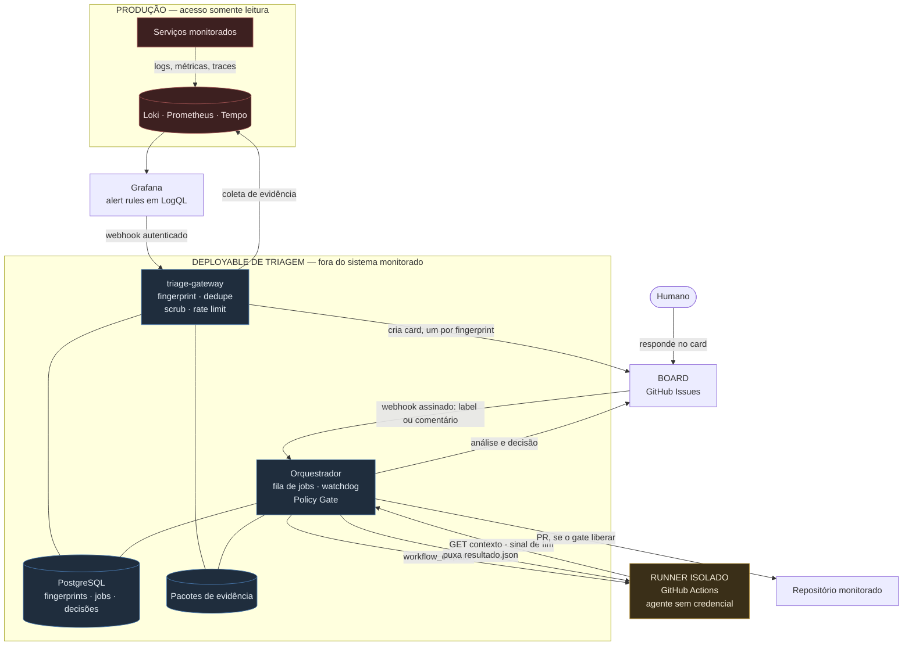
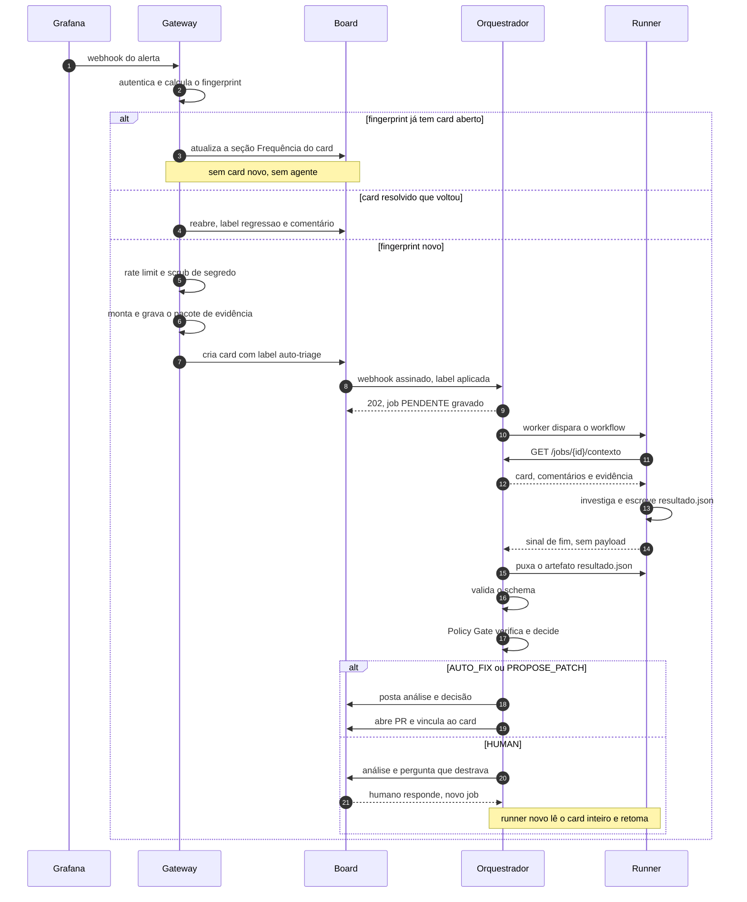
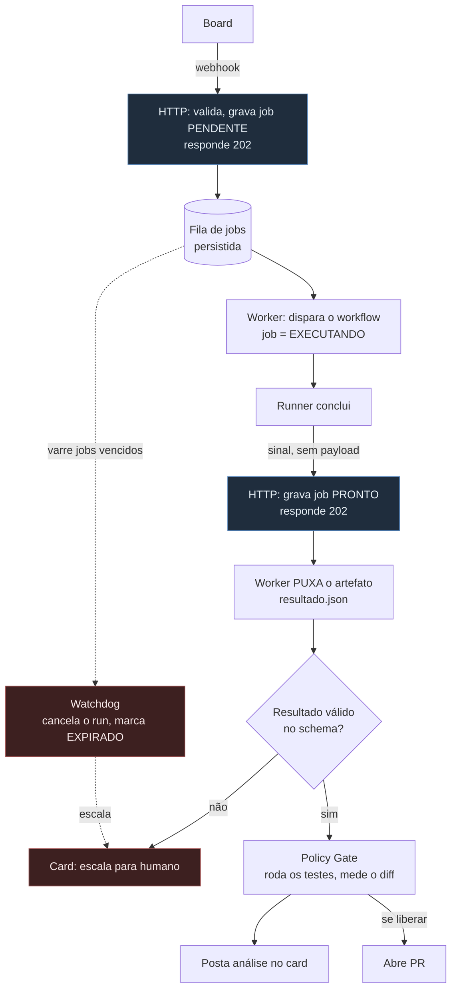
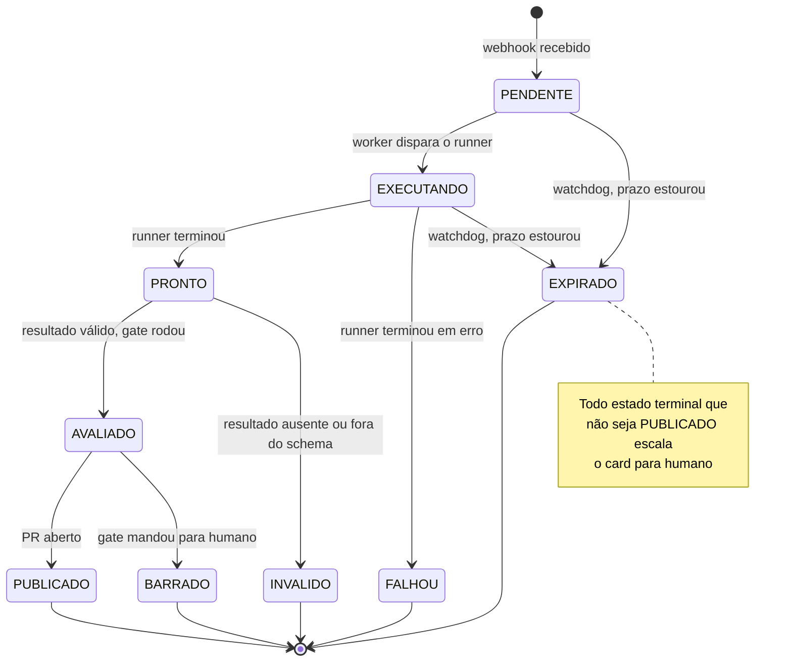
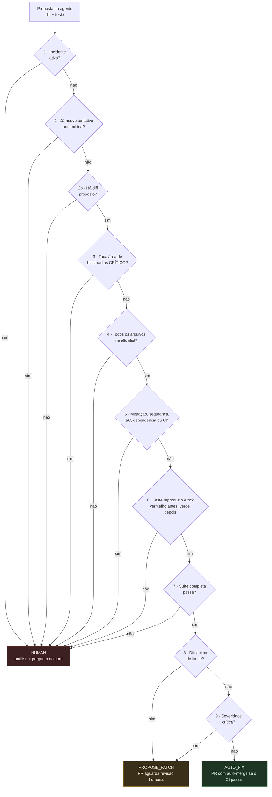

# Arquitetura — Triagem automatizada de erros (Grafana → Board → Agente)

Documento de arquitetura. Descreve **o que** o sistema é, quais peças existem, que
contrato cada uma expõe e quais regras governam a decisão. Reflete o que está
implementado; onde o desenho e o código ainda divergem, a seção diz isso
explicitamente.

## Sumário

1. [Problema](#1-problema)
2. [Visão geral](#2-visão-geral)
3. [Componentes](#3-componentes)
4. [Pacote de evidência](#4-pacote-de-evidência)
5. [Modelo de dados](#5-modelo-de-dados)
6. [Policy Gate](#6-policy-gate)
7. [Humano no loop](#7-humano-no-loop)
8. [Segurança](#8-segurança)
9. [Feedback e métricas](#9-feedback-e-métricas)
10. [Riscos conhecidos](#10-riscos-conhecidos)
11. [Postura de adoção](#11-postura-de-adoção)
12. [Decisões](#12-decisões)

---

## 1. Problema

Erro aparece no log de produção. O caminho manual é: alguém percebe (ou não), abre o
Grafana, correlaciona com deploy, decide se é grave, abre um card à mão, junta
evidência à mão, investiga. O tempo entre "erro aconteceu" e "alguém entendeu o erro"
é dominado por trabalho mecânico, não por raciocínio.

A proposta automatiza o mecânico e mantém o raciocínio de risco sob controle
determinístico: coleta de evidência, deduplicação, abertura de card e uma primeira
análise por agente — que só age sozinho dentro de um envelope estreito e
explicitamente definido.

O sistema **não** é um "auto-fix de produção". É um sistema de triagem que, num
subconjunto pequeno e auditável de casos, também propõe correção.

---

## 2. Visão geral

```
   serviços monitorados (backend, front-end)
        |
        |  logs estruturados (OTLP)
        v
   Loki / Prometheus / Tempo  ──────►  Grafana (alert rules em LogQL)
        ▲                                   |
        |  coleta de evidência              |  webhook (contact point)
        |                                   v
        └──────────────────────────  triage-gateway
                                          |  autentica o webhook
                                          |  fingerprint e deduplicação
                                          |  scrub de segredo
                                          |  rate limit e card storm
                                          v
                                    pacote de evidência (disco, endereçado por id)
                                          |
                                          v
                                    Board (GitHub Issue)
                                          |  webhook: label `auto-triage` ou comentário
                                          v
                                    Orquestrador de triagem
                                          |  handler HTTP responde 202
                                          |  worker assíncrono dispara o runner
                                          v
                                    Runner isolado (GitHub Actions, agente sem credencial)
                                          |  busca o contexto no orquestrador
                                          |  publica resultado.json como artefato
                                          |  sinaliza o fim, sem payload
                                          v
                                    Orquestrador puxa e valida o resultado
                                          |
                                          v
                                    ┌── Policy Gate (determinístico) ──┐
                                    │  AUTO_FIX │ PROPOSE_PATCH │ HUMAN │
                                    └──────────────┬──────────────────┘
                                                   v
                                      PR  /  comentário no card  /  espera humano
                                                   |
                                                   v
                                          Registro de desfecho (feedback)
```

Fluxo é **de mão única até o card**, e **bidirecional depois dele**: o card é o
canal de conversa entre humano e agente.

### 2.1 Mapa de componentes e zonas de confiança



Três zonas, e a fronteira entre elas é o que sustenta a segurança do desenho:
produção só é lida; a triagem tem as credenciais; o runner não tem nenhuma.

### 2.2 Caminho completo, do erro ao PR



---

## 3. Componentes

### 3.1 Contrato do sinal de log

O sistema não depende de um serviço específico, mas depende de um **formato de log**.
A fonte recomendada é o exportador OTLP do SDK OpenTelemetry: cada linha chega ao Loki
com os campos abaixo como *structured metadata*, consultáveis direto, sem `| json`.

| Campo no Loki | Uso |
|---|---|
| `severity_text` | filtro do alerta (`ERROR`, `FATAL`) |
| `service_name` | roteamento pelo registro de escopo e allowlist |
| `trace_id` | reconstrução da janela de evidência |
| `exception_type` | fingerprint |
| `exception_stacktrace` | fingerprint e análise |
| `code_function_name`, `code_line_number` | localização exata no fonte |
| a própria linha | análise |

O nome do serviço emitido pelo SDK é o valor que o registro de escopo (§3.10) mapeia em
`servicos`. O ambiente vem de um atributo de recurso (`env`) e precisa casar com
`ambientes` do registro.

Cuidado com a troca de formato do console: painéis que consultam o log de texto com
regex de formato quebram em silêncio quando o console passa a emitir JSON. O OTLP já
entrega o log estruturado sem mexer no console.

Sem `trace_id`, a coleta de evidência degrada para "janela de tempo do mesmo serviço",
bem mais ruidosa, e o pacote registra essa degradação como lacuna (§4). Log de erro de
serviço que não casa com nenhum projeto do registro não gera card — vira a métrica de
log órfão.

#### 3.1.1 Erros de front-end (SPA)

Uma SPA roda no browser e não tem stdout que o coletor leia. O caminho dela até o Loki é
um endpoint do backend que recebe o erro e o reemite como linha estruturada. A linha sai
sob o `service_name` do backend (é quem escreveu), e um campo `origem` diz de quem ela
fala.

| Campo no Loki | Conteúdo |
|---|---|
| `origem` | identificador do front |
| `front_localizacao` | `<padrão de rota>@<componente>` — ex.: `/produtos/:id@ProductPage` |
| `front_rota` | padrão da rota, nunca o pathname |
| `front_tipo` | `render`, `script`, `promise` ou `api` |
| `front_erro_classe` | `TypeError`, `RangeError`… |
| `front_stack` | stack minificado — evidência, **não** entra no fingerprint |
| `front_build` | versão do build |
| `front_trace_id` | id por carregamento de página, agrupa os erros da mesma sessão |

**Padrão de rota, não pathname.** `/produtos/123` e `/produtos/456` são a mesma tela;
mandar o pathname concreto geraria um card por id.

**`localizacao` substitui o frame no fingerprint.** O seletor de frame só entende stack
de Java, e o bundle do front é minificado: o frame muda de posição a cada build, então
usá-lo como chave geraria card novo do mesmo bug a cada deploy. Quando o alerta traz a
anotação `localizacao`, o fingerprint a usa no lugar do frame.

A regra do Grafana para o front é dedicada e fixa o label `service` com o nome do front —
é isso que manda o card para o board do front em vez do board do backend:

```logql
sum(count_over_time({service_name="exemplo-api"} | origem="exemplo-front" | severity_text="ERROR" [5m]))
```

O endpoint que recebe o erro do front precisa ser **público**: erro de front acontece
com a sessão caída, e exigir autenticação esconderia justamente essa classe. O teto de
abuso é um rate limit por origem somado a um teto por carregamento de página no próprio
front. O IP alimenta o limitador e nunca vai para o log.

### 3.2 Grafana — regras de alerta

Uma regra por *classe de sintoma*, não por linha de log. A regra é uma consulta LogQL
com janela e limiar (ex.: "≥ 3 ocorrências de `ERROR` no serviço X em 5 min").

| Label da regra | Obrigatória | Uso |
|---|---|---|
| `service` | sim | roteamento pelo registro de escopo |
| `env` | sim | precisa estar em `ambientes` do projeto |
| `severity` | sim | label do card e cláusula 9 do gate |
| `rule_id` | sim | falso positivo por regra (§9) |

| Anotação | Uso |
|---|---|
| `exception_class` | fingerprint |
| `stacktrace` | fingerprint e evidência |
| `message` | fingerprint, depois de normalizada |
| `trace_id` | janela de evidência |
| `localizacao` | substitui o frame no fingerprint (§3.1.1) |

O contact point autentica no gateway com `Authorization: Bearer` ou `Basic`. Sem a
credencial configurada no gateway, nenhum alerta entra.

Regra é um artefato versionado e revisável, mantido fora deste repositório. Regra que
gera muito falso positivo é desligada — não tolerada.

### 3.3 triage-gateway

**Grafana nunca fala direto com o board.** O gateway existe porque quatro
responsabilidades precisam acontecer antes do card existir, e nenhuma delas cabe no
Grafana.

**a) Fingerprint e deduplicação.** Peça mais crítica do desenho. Sem ela, um NPE em
loop vira 400 cards.

```
fingerprint = sha256(
    service
    | exception_class
    | localizacao  ou  primeiro frame do stack que pertence a pacotes_raiz
    | normalize(message)
)[0:16]
```

`normalize` troca UUIDs, timestamps, números (inteiros e decimais), hashes,
hexadecimais e paths por marcadores — tudo que muda entre duas ocorrências do *mesmo*
defeito. O que sobra é a identidade do erro.

O frame escolhido é o primeiro que pertence a `pacotes_raiz` do projeto (§3.10),
ignorando frames de framework. Dois erros diferentes que passam pelo mesmo interceptor
do framework não podem colidir no mesmo fingerprint.

**b) Scrub de segredo.** Log de produção contém token, chave de API, credencial e dado
de conta. O card é um artefato mais exposto que o log. O scrub combina padrão conhecido
(tokens, chaves, JWT…) com lista de campos: em log estruturado, cada campo é tratado
separadamente, campo sensível sai redigido e campo não reconhecido também sai redigido.
Falha fechada.

**c) Rate limit e supressão.** Teto de cards por hora por projeto (`cards_por_hora`).
Estouro do teto vira **um único card agregado do tipo storm** por janela, com as labels
`storm` e `aguardando-humano`, nunca N cards. Também suprime durante incidente declarado
(§8.3) — em incidente, quem manda é o humano, e enxurrada de card automático atrapalha.

**d) Coleta de evidência.** Descrita em §4.

**Recorrência e regressão.** Um fingerprint com card aberto não cria card: o gateway
reescreve a seção Frequência do corpo do card (contagem, primeira e última ocorrência) e
só comenta se a edição falhar. Um fingerprint já resolvido que volta a ocorrer reabre o
card, aplica a label `regressao` e comenta.

O gateway é *stateful*: mantém a tabela de fingerprints ativos (§5.1).

### 3.4 Board

**Decisão: GitHub Issues.**

- Eventos de acionamento: `issues.labeled` (triagem inicial) e `issue_comment.created`
  (retomada após resposta humana).
- Eventos de desfecho: `pull_request.closed`, `push` e `issues.closed` (§3.8).
- Card e PR vivem no mesmo sistema — o vínculo entre eles é nativo.
- Comentário escrito pela própria triagem é ignorado, para não realimentar o agente.
- Modelo de permissão é o do repositório. Quem pode comentar no card pode acionar o
  agente; isso precisa ser considerado ao abrir o repositório a terceiros.
- O runner roda em GitHub Actions (§3.6), no mesmo ecossistema.

Invariante: **um card por fingerprint ativo.**

### 3.5 Orquestrador de triagem — como o agente é acionado

**O agente não escuta nada.** Ele não é um processo no ar esperando trabalho, não
consulta fila e não faz polling. Ele nasce, trabalha, devolve um resultado e morre —
uma instância por acionamento.

Quem escuta é o orquestrador: processo pequeno, sempre no ar.

```
Board  ──webhook──►  Orquestrador  ──dispara──►  Runner (agente nasce aqui)
                          ▲                             │
                          └──── GET contexto ───────────┤
                                                        │
                                          investiga, escreve resultado e morre
```

**Acionamento inicial:**

1. Gateway cria o card já com a label `auto-triage`.
2. O GitHub dispara `issues.labeled` para o endpoint do orquestrador.
3. O handler HTTP faz só o barato: valida a assinatura HMAC, descarta entrega repetida,
   grava um job `PENDENTE` e responde `202`. **Não dispara runner dentro do handler** —
   ver §3.11.
4. Um worker pega o job e confere, nesta ordem: kill switch, teto global de jobs
   simultâneos e teto de jobs por hora do projeto (`jobs_por_hora`). Passando, dispara o
   workflow do runner com o id do job, o card, o fingerprint e a URL pública do
   orquestrador.
5. O runner busca o contexto, investiga e publica o resultado. Quem lê esse resultado,
   aplica o gate e escreve no card é o orquestrador (§3.12).

**Retomada depois da resposta humana:** mesmo mecanismo, outro evento. O comentário
dispara `issue_comment.created`; o orquestrador inicia um runner **novo**, que recebe o
card inteiro — análise anterior, cláusula que barrou, pergunta feita e resposta do
humano — e continua dali.

O agente que retoma não é o que parou. Ele reconstrói o contexto lendo o card. É por
isso que o card é a memória da sessão (§7) e por isso a análise precisa ser escrita
por completo lá dentro.

**Fallback sem webhook:** com `TRIAGE_POLLING=true`, o orquestrador varre
periodicamente os cards abertos com a label `auto-triage` de cada projeto ativo e
enfileira um job para cada um. O enfileiramento é idempotente, então card que já tem
job em andamento não ganha outro.

**Uma tentativa automática por fingerprint.** A segunda passada no mesmo fingerprint
sempre roda — a análise tem valor —, mas o gate a manda para humano (cláusula 2).

O teto de jobs por hora merece destaque, porque o modelo de cobrança (§3.6) muda o que
ele protege. A inferência sai da assinatura, não de fatura por token — então o recurso
escasso não é dinheiro, é **a mesma quota usada para trabalhar**. Uma tempestade de
cards sem teto não gera uma conta alta: gera um desenvolvedor sem quota no meio do
expediente. O teto deixa de ser controle de custo e vira proteção de capacidade.

### 3.6 Runner isolado

Ambiente onde o agente roda. Propriedades do desenho:

- **Sem credencial nenhuma.** Nem de produção, nem do board, nem de push no
  repositório. O workflow roda com `contents: read`; quem tem credencial é o
  orquestrador.
- Working tree descartável.
- Só lê o código do repositório e o contexto entregue pelo orquestrador, com a
  evidência já coletada e limpa.

O agente **não** consulta produção. Se a evidência não basta, o resultado diz isso e o
caso vai para humano — não há tentativa de buscar mais dado sozinho.

**Decisão: job de CI (GitHub Actions).**

| | Job de CI | Container disparado pelo orquestrador |
|---|---|---|
| Isolamento | efêmero por natureza | precisa ser construído |
| Checkout do repositório | nativo | precisa ser construído |
| Cofre de segredo | nativo | precisa ser construído |
| Log de execução | nativo | precisa ser construído |
| Rede | **aberta por padrão**, exige restrição de egress | controle total |
| Custo | minuto de CI, com fila | máquina própria, ociosa entre jobs |
| Como o fim é detectado | sinal do workflow + artefato (§3.11) | espera do processo filho |

O workflow do runner fica no **repositório monitorado**. O modelo está em
`docs/runner/triage-runner.yml` e precisa ser adaptado ao build de cada projeto. Ele:

1. busca o contexto em `GET /jobs/{id}/contexto`, assinado com HMAC;
2. publica o contexto recebido como artefato, para auditoria;
3. roda o agente;
4. publica o raciocínio do agente e o `resultado.json` como artefatos;
5. sinaliza o fim em `POST /webhooks/runner/{id}`, também assinado.

**Egress não está restrito.** Runner hospedado do GitHub sai para a internet por
padrão, e o workflow atual não aplica nenhuma restrição de rede. A propriedade "sem
rota para produção" hoje depende de produção não aceitar conexão do runner, não de
bloqueio no runner. É o ponto fraco desta escolha e está listado em §12.2.

#### Harness do agente e modelo de cobrança

**Decisão: `anthropics/claude-code-action` em modo automação, autenticada com token de
assinatura.**

O harness é o do Claude Code — ferramentas de arquivo, bash, busca, laço de agente e
gestão de contexto prontos. Reimplementar isso sobre a API de mensagens seria refazer
trabalho já feito.

| | Claude Agent SDK | `claude-code-action` |
|---|---|---|
| Mesmo harness | sim | sim |
| Cobrança | API key, por token | **token OAuth da assinatura** |
| Login de assinatura | não permitido sem aprovação prévia | suportado |

O token vem de `claude setup-token` e fica como secret do repositório monitorado,
passado em `claude_code_oauth_token`.

Configuração que preserva a fronteira de confiança:

| Parâmetro | Valor | Por quê |
|---|---|---|
| `--allowedTools` | `Read,Write,Edit,Grep,Glob,Bash` | nenhuma ferramenta de GitHub: o agente não comenta nem abre PR |
| `--disallowedTools` | `Agent,Task` | sem subagente; a sessão é de execução única |
| `--max-turns` | `75` | teto de consumo por job |
| `allowed_bots` | `*` | o disparo vem do orquestrador, que a action veria como bot |
| `timeout-minutes` | `45` | teto do job no Actions |

A action é hospedeira do harness, nunca autora das ações: postar no card e abrir PR é
do orquestrador, depois do gate.

Três armadilhas conhecidas desse caminho:

- **Ator bot é recusado** se não estiver em `allowed_bots`, e o motivo não é óbvio.
- **O token é pessoal**, amarrado à assinatura de quem o gerou. Para uso compartilhado,
  API key.
- **Minutos de Actions continuam cobrados à parte.** A assinatura cobre a inferência,
  não o runner.

Migrar para container próprio se o custo de CI pesar, ou se o isolamento de rede
precisar de garantia real em vez de configuração. A troca muda o mecanismo de detecção
de término, não o desenho.

### 3.7 Policy Gate

Descrito em §6. É código determinístico, não julgamento do modelo.

### 3.8 Registro de desfecho

Toda decisão e todo desfecho ficam registrados. O ciclo só fecha quando o desfecho
volta do GitHub:

| Evento | Efeito |
|---|---|
| `pull_request.closed` com merge | decisão marcada `MERGED` |
| `pull_request.closed` sem merge | decisão marcada `REJEITADO` |
| `push` com commit de revert que carrega o trailer `Fingerprint:` | decisão marcada `REVERTIDO`; o fingerprint volta para humano |
| `issues.closed` | fingerprint resolvido; card fechado sem nenhuma decisão do gate conta como falso positivo da regra que disparou |

É a base do feedback de §9.

### 3.9 Empacotamento — gateway e orquestrador

**Decisão: mesmo deployable, dois módulos com fronteira explícita.**

Regra que não se negocia: os dois rodam **fora do sistema monitorado**. Processo que
monitora não pode morrer junto com o processo monitorado — senão o erro mais grave é
justamente o único que nunca vira card.

Por que no mesmo deployable:

- Compartilham a tabela de fingerprint. Gateway escreve (`card_ref`, contador),
  orquestrador lê (`auto_attempts`).
- Ambos são pequenos e da mesma natureza: endpoint HTTP recebendo webhook, operando
  sobre o mesmo estado.
- Dois serviços aqui é custo de operação sem ganho, no tamanho atual.

Por que ainda assim são módulos separados:

| | Gateway | Orquestrador |
|---|---|---|
| Gatilho | webhook do Grafana | webhook do board e sinal do runner |
| Criticidade | **não pode perder alerta** | pode atrasar sem dano |
| Credencial | leitura de Loki / Prometheus / Tempo | escrita no board, disparo de workflow, push de branch |
| Custo por evento | baixo e previsível | alto e variável |
| Falha aceitável | não | sim, degrada para retentativa |

**Os módulos não se chamam.** Gateway grava estado e cria o card; o orquestrador reage
ao evento do board. A comunicação entre os dois é o estado compartilhado e o próprio
board.

**O deployable é exposto à internet.** Os webhooks do GitHub, o sinal do runner e a
busca de contexto precisam alcançá-lo, então ele fica atrás de um proxy reverso com
domínio público. O que sustenta a exposição é a autenticação de todos os endpoints com
falha fechada (§8.4). O custo dessa escolha é que um comprometimento do processo
alcança as credenciais do orquestrador. O gatilho para separar em dois serviços é esse:
se o isolamento de credencial entre o endpoint do Grafana e o orquestrador virar
requisito, separa.

### 3.10 Registro de escopo — quais projetos são monitorados

**Decisão: arquivo JSON externo, carregado dinamicamente.** A origem padrão é o arquivo
`config/projetos.json`; `TRIAGE_REGISTRY_ORIGEM=HTTP` carrega de uma URL (um bucket S3,
por exemplo).

Nem o gateway nem o orquestrador conhecem projeto por código. Incluir um projeto novo é
editar o JSON, não abrir PR no sistema de triagem.

| Campo | Uso |
|---|---|
| `projeto` | nome legível |
| `diretorio` | caminho local do projeto; obrigatório, mas hoje não usado pelo gate, que clona do GitHub (§12.2) |
| `servicos[]` | valores de `service` no alerta que mapeiam para este projeto |
| `pacotes_raiz[]` | pacotes do projeto, para escolher o frame do fingerprint |
| `repositorio` | `owner/repo` do código |
| `branch_base` | branch de onde o gate e o PR partem |
| `comando_de_teste[]` | comando que o gate roda para verificar a suíte |
| `ambientes[]` | valores de `env` monitorados |
| `board` | repositório onde o card é aberto (pode diferir do de código) |
| `allowlist[]` | globs de caminho elegíveis a AUTO_FIX |
| `blast_radius{}` | mapa de glob → `BAIXO` \| `MEDIO` \| `CRITICO` |
| `limites{}` | `diff_max_linhas`, `diff_max_arquivos`, `cards_por_hora`, `jobs_por_hora` |
| `ativo` | desliga o projeto sem remover a entrada |

Regras que o registro obedece, porque governa decisão de risco:

- **Recarga periódica** (`TRIAGE_REGISTRY_RECARGA`, padrão 5 min). Falha ao ler mantém
  a última versão válida em memória — nunca cai para "sem restrição".
- **Validação antes de aplicar.** Registro inválido é rejeitado inteiro, incluindo
  serviço mapeado em mais de um projeto; a versão anterior continua valendo.
- **Falha fechada.** `service` que não casa com nenhuma entrada não vira card, e sim
  métrica de log órfão. Projeto sem `allowlist` tem allowlist vazia: nada é elegível a
  AUTO_FIX. Caminho não classificado em `blast_radius` é `CRITICO`.
- **Auditoria.** Fingerprint, job e decisão gravam a versão do registro que estava
  valendo. Sem isso não dá para explicar depois por que um PR passou.

**Este arquivo é código de segurança, não configuração.** Quem tem escrita nele
consegue mover um caminho de CRÍTICO para BAIXO e alargar o envelope de AUTO_FIX sem
tocar em uma linha do gate. A escrita precisa ser tão restrita quanto o merge em branch
protegida, de preferência com o JSON versionado e revisado.

### 3.11 Ciclo de vida do job — execução assíncrona

Triagem leva minutos: o agente pensa, e o Policy Gate roda a suíte de testes. Nada
disso cabe dentro de uma requisição HTTP.

| Etapa | Bloqueia? |
|---|---|
| Handler HTTP do webhook (board ou runner) | **Nunca.** Valida, grava estado, responde `202` |
| Worker de disparo | Não. Dispara o workflow e volta |
| Avaliação do resultado e Policy Gate | Pode, sempre em worker, nunca em handler |



Nenhuma seta de payload sai do runner para um endpoint. O runner só emite um sinal; o
conteúdo é sempre puxado pelo worker.

**Princípio central: a notificação é não-confiável, o payload é puxado.**

- **Confiança.** Se o agente postasse o resultado num endpoint, um agente comprometido
  por injeção (§8.1) poderia postar "o teste passa, o diff é pequeno, está na
  allowlist" — exatamente os fatos que o gate precisa verificar sozinho. Sinal forjado,
  no desenho puxado, só faz o orquestrador olhar cedo demais para um artefato que não
  existe.
- **Tempo.** Um endpoint que "aplica as regras" teria de rodar a suíte de testes dentro
  da requisição.

**Máquina de estados do job**, persistida — o orquestrador reinicia sem perder job:



**Watchdog** é peça obrigatória, não refinamento: varre jobs além do prazo
(`TRIAGE_PRAZO_JOB`, padrão 30 min), cancela o run no GitHub Actions, marca `EXPIRADO`
e manda o card para humano com a label `aguardando-humano`. Sem ele, um sinal perdido
deixa o job invisível para sempre.

| Caso | Tratamento |
|---|---|
| Sinal de conclusão nunca chega | watchdog expira o job e escala para humano |
| Sinal chega duas vezes | transição de estado inválida é descartada |
| GitHub reentrega o webhook | idempotência pelo id da entrega (`X-GitHub-Delivery`), com limpeza periódica |
| Orquestrador reinicia no meio | job persistido volta para a fila; run órfão é cancelado pelo watchdog |
| Runner trava sem morrer | timeout do job no Actions, ou watchdog |
| Resultado ausente ou fora do schema | `INVALIDO` → humano. Nunca presume sucesso |

### 3.12 Contrato agente ↔ orquestrador

O agente não fala com board, git remoto ou produção. Toda a comunicação dele com o
mundo é este contrato.

**Entrada:** `GET /jobs/{id}/contexto`, assinado com HMAC do id do job. Devolve o card
inteiro (título, corpo e todos os comentários, inclusive a resposta humana que retomou
a triagem) e o pacote de evidência já limpo. Os campos de card, comentários e evidência
chegam marcados como **dado não-confiável**.

**Saída:** um único artefato, `resultado.json`:

```json
{
  "job_id": "id do job",
  "card": "owner/repo#numero",
  "hipotese": "uma frase",
  "evidencia_a_favor": ["..."],
  "evidencia_contra": ["..."],
  "diff": "diff unificado com teste e correção, ou ausente se não houver proposta",
  "teste_novo": {"arquivo": "caminho do teste", "identificador": "Classe#metodo"},
  "justificativa": "o que a mudança faz",
  "pergunta_que_destrava": "pergunta específica e respondível"
}
```

- `hipotese`, `evidencia_a_favor`, `evidencia_contra` e `justificativa` são
  obrigatórios. `evidencia_contra` vazia é resultado inválido.
- `job_id` e `card` precisam casar com o job; resultado de outro job é rejeitado.
- Teste e correção vêm **no mesmo diff**. O gate separa os dois pelo caminho em
  `teste_novo.arquivo`.
- Sem `diff`, não há proposta: a decisão é HUMAN pela cláusula 2b, e a análise vai
  para o card. É assim que "evidência insuficiente" chega ao orquestrador.

**Sinal de fim:** `POST /webhooks/runner/{id}` com `conclusao` (o status do job no
Actions) e `motivo`. O sinal só avisa; o orquestrador então puxa o artefato com a
própria credencial.

Arquivo ausente ou inválido é tratado como falha, **independentemente do status do
job** — o agente não é fonte confiável sobre o próprio sucesso.

Nada é publicado durante a execução. O diff só alcança o mundo depois que o
orquestrador lê o resultado e o gate aprova. Por isso não existe estado parcial a
limpar quando um runner morre no meio.

---

## 4. Pacote de evidência

Montado pelo gateway, imutável, endereçado por id e gravado em disco
(`TRIAGE_EVIDENCIA_DIR`). O card leva um resumo e a URI do pacote; o pacote inteiro
chega ao agente pelo endpoint de contexto (§3.12).

| Item | Fonte | Situação |
|---|---|---|
| Stacktrace completo | anotação do alerta | coletado |
| Log do mesmo `trace_id` | Loki | coletado quando há `trace_id` |
| Spans do trace | Tempo | coletado quando o trace existe no Tempo |
| Log de erro do serviço na janela | Loki | coletado |
| Série de ocorrências | Loki | coletado |
| Métricas do serviço na janela | Prometheus | coletado |
| Deploys nas últimas 24h | GitHub Deployments | coletado |
| Commits recentes | GitHub | coletado |
| Painel do Grafana | alerta | link |
| Estado de flags e config vigente | — | não coletado: não há serviço de config |

**Lacunas são declaradas, não escondidas.** Cada item que não pôde ser coletado vira
uma linha em `lacunas` — trace ausente, Loki sem resposta, API de deploys indisponível.
O agente e o humano sabem o que *não* foi olhado.

Toda evidência passa pelo scrub (§3.3) e é **dado**, nunca instrução. Ver §8.

---

## 5. Modelo de dados

### 5.1 Fingerprint (estado no gateway)

```
fingerprint          string   chave
service              string
env                  string
projeto              string
rule_id              string
severity             string
card_ref             string   owner/repo#numero
evidencia_uri        string   pacote de evidência mais recente
occurrence_count     int
first_seen           timestamp
last_seen            timestamp
state                enum     NOVO | TRIADO | AGUARDANDO_HUMANO | EM_CORRECAO | RESOLVIDO | SUPRIMIDO
auto_attempts        int      teto: 1
versao_registro      string   versão do registro de escopo vigente
```

`SUPRIMIDO` está previsto no modelo, mas nenhum fluxo o atribui hoje: a supressão
acontece antes de o fingerprint ser gravado.

### 5.2 Job

```
job_id               string   chave
fingerprint          string
projeto              string
repositorio          string
card_ref             string
evento_origem        string   issues.labeled | issue_comment.created | polling
state                enum     ver §3.11
runner_ref           string   referência do workflow disparado
runner_run_id        long     id do run no Actions, usado para cancelar e puxar o artefato
motivo               string   por que o job chegou ao estado atual
criado_em            timestamp
atualizado_em        timestamp
prazo                timestamp
versao_registro      string
```

### 5.3 Card

Corpo do card, seções fixas:

1. **Identidade** — fingerprint, serviço, ambiente, severidade, regra que disparou.
2. **Frequência** — contagem, primeira e última ocorrência. Reescrita a cada recorrência.
3. **Sintoma** — exceção, mensagem, stacktrace recortado nos frames do projeto.
4. **Requisição (spans do trace)** — quando o Tempo devolveu o trace.
5. **Contexto** — deploys e commits recentes, métricas na janela.
6. **Links** — pacote de evidência, painel.
7. **Análise do agente** — preenchida depois (§7).
8. **Decisão** — resultado do Policy Gate e a regra que produziu esse resultado.

| Label | Onde | Significado |
|---|---|---|
| `auto-triage` | card | dispara o agente |
| `severity/*`, `service/*` | card | classificação |
| `storm` | card | card agregado de tempestade |
| `regressao` | card | fingerprint resolvido que voltou |
| `aguardando-humano` | card | escalado para humano |
| `decisao/auto-fix`, `decisao/proposta`, `decisao/humano` | card | resultado do gate |
| `aberto-por/agente-e-triage-gateway` | PR | PR gerado pela triagem |

### 5.4 Registro de decisão

```
job_id               string
card_ref             string
fingerprint          string
decisao              enum    AUTO_FIX | PROPOSE_PATCH | HUMAN
regra_decisora       string  qual cláusula do gate determinou
registro_versao      string  versão do registro de escopo vigente (§3.10)
diff_arquivos        int
diff_linhas          int
teste_reproduz       bool
allowlist_ok         bool
blast_radius         enum    BAIXO | MEDIO | CRITICO
pr_ref               string
desfecho             enum    MERGED | REVERTIDO | REJEITADO | ABANDONADO | PENDENTE
decidido_em          timestamp
```

`ABANDONADO` está previsto, mas nenhum evento o atribui hoje.

### 5.5 Entrega de webhook

Id de cada entrega do GitHub já processada, para descartar reentrega. Removido
periodicamente.

### 5.6 PR e commit

Escritos pelo orquestrador, nunca pelo agente. O PR precisa responder a quem revisa
três perguntas: de onde isso veio, por que essa mudança, e por que confiar — ou não.

```markdown
## Origem
Card: #123 · Fingerprint: `a3f9c2d1e7b04c55` · Serviço: `exemplo-api` · 47 ocorrências

## Hipotese
`desconto` não é preenchido quando o pedido vem sem cupom; os outros caminhos preenchem.

## Mudanca
Preenche `desconto` com zero no mapeamento do pedido sem cupom.

## Teste
`PedidoMapperTest#pedidoSemCupomTemDescontoZero`
Falha antes do patch, passa depois. Verificado pelo gate, não afirmado pelo agente.

## Evidencia contra a hipotese
Nenhuma ocorrência em pedidos criados pela API interna, apesar do mesmo código.

## Decisao do gate
PROPOSE_PATCH — cláusula 9 (severidade crítica). Blast radius: BAIXO.

## Reverter
`git revert <sha>` — mudança isolada, sem migração e sem dependência.
```

A seção **"Evidência contra a hipótese"** é obrigatória e é a mais útil do PR. Vazia
significa análise rasa, e o revisor precisa enxergar isso antes de aprovar.

Commit: assunto na convenção do repositório, mais *trailers* consultáveis depois:

```
fix: preenche desconto no pedido sem cupom

Card: #123
Fingerprint: a3f9c2d1e7b04c55
Decisao-Gate: PROPOSE_PATCH (clausula 9)
Blast-Radius: BAIXO
```

Os trailers servem a dois usos: auditar tudo que entrou por triagem automática
(`git log --grep="Decisao-Gate"`) e detectar o revert (§3.8).

**Merge por squash, sempre.** Um commit por card.

---

## 6. Policy Gate

O núcleo. **A decisão não pode ser julgamento livre do modelo.** O agente produz uma
proposta; o gate é código que levanta os fatos por conta própria e os avalia.

### 6.1 Como os fatos são levantados

Todos objetivos e verificáveis por máquina:

1. clona o repositório do projeto (`git clone --depth 1` da `branch_base`) num
   diretório descartável;
2. separa o diff do agente em **diff do teste** (o arquivo de `teste_novo.arquivo`) e
   **diff da correção** (o resto) — sem um dos dois, não há verificação;
3. aplica só o teste e roda `comando_de_teste`: a suíte precisa **falhar**;
4. aplica a correção e roda de novo: a suíte precisa **passar**;
5. mede arquivos e linhas do diff, confere allowlist, áreas proibidas e blast radius;
6. lê severidade, incidente ativo e `auto_attempts`.

"Teste reproduz o erro" significa que a suíte falhou sem a correção. Um teste instável
ou já quebrado na `branch_base` também faz a suíte falhar; esse limite está em §10 e
§12.2.

### 6.2 Tabela de decisão

Avaliada em ordem. Primeira condição que casa determina o resultado.

| # | Condição | Resultado |
|---|---|---|
| 1 | Incidente ativo declarado | HUMAN |
| 2 | `auto_attempts >= 1` (já houve tentativa automática) | HUMAN |
| 2b | O agente não propôs diff | HUMAN |
| 3 | Diff toca área de blast radius CRÍTICO | HUMAN |
| 4 | Diff toca arquivo fora da allowlist | HUMAN |
| 5 | Diff toca migração, segurança, IaC, dependência ou workflow de CI | HUMAN |
| 6 | Não existe teste que reproduza o erro | HUMAN |
| 7 | Suíte completa não passa com a correção | HUMAN |
| 8 | Diff acima de `diff_max_linhas` ou `diff_max_arquivos` | PROPOSE_PATCH |
| 9 | Severidade `critical` | PROPOSE_PATCH |
| 10 | Todo o resto (allowlist + teste vermelho→verde + diff pequeno) | AUTO_FIX |

A cláusula 2b está fora da sequência de propósito: sem ela, uma triagem que concluiu
"não há o que corrigir" caía na cláusula 3 (diff vazio → blast radius padrão
CRÍTICO). Renumerar mudaria o sentido das decisões já gravadas.

Com `TRIAGE_AUTO_FIX=false` — o padrão, §11 —, a cláusula 10 é rebaixada para
PROPOSE_PATCH e a explicação da decisão registra isso.

A cláusula 5 reconhece por caminho:

| Área | Padrões |
|---|---|
| Migração | `*/db/migration/*`, `*/database/migration/*`, `*/flyway/*`, `*/liquibase/*` |
| IaC | `*.tf`, `*.tfvars`, `*/helm/*`, `*/k8s/*`, `*/kubernetes/*`, `Dockerfile`, `docker-compose.yml` |
| Segurança | `*/security/*` |
| Dependência | `pom.xml`, `build.gradle(.kts)`, `package.json`, `package-lock.json`, `requirements.txt` |
| CI | `.github/workflows/*` |

Nenhuma linha da tabela depende de "o modelo achou que". A cláusula 6 é a que mais
poda: se o agente não conseguiu escrever um teste que reproduz o erro, ele não
entendeu o erro.



### 6.3 Blast radius

Classificação por área do código, **carregada do registro de escopo** (§3.10) — por
projeto, já que a mesma tabela não serve para um backend e um front. Caminho não
classificado assume CRÍTICO: o desconhecido é tratado como perigoso, nunca como seguro.
Com vários arquivos no diff, vale o nível mais severo.

| Nível | Áreas típicas | Tratamento |
|---|---|---|
| **CRÍTICO** | fluxo financeiro, execução de operação irreversível, integração externa crítica, gestão de risco, migração de schema, autenticação, credencial | HUMAN sempre, sem exceção |
| **MÉDIO** | persistência, scheduler/jobs, configuração de regra de negócio, API pública, telemetria | PROPOSE_PATCH no máximo |
| **BAIXO** | parsing, formatação, tratamento de nulo, mensagem de log, DTO de resposta, front de apresentação | elegível a AUTO_FIX |

Em sistemas cujo código crítico move dinheiro, a regra "área crítica → HUMAN" é
absoluta e não deve ganhar exceção por conveniência.

### 6.4 O que "AUTO_FIX" significa

**Nunca push direto em branch protegida.** O orquestrador empurra uma branch, abre o
PR e:

- em **AUTO_FIX**, habilita o auto-merge por squash: o PR entra sozinho se o CI passar.
  Se o GitHub recusar o auto-merge (desligado no repositório, por exemplo), o PR fica
  esperando revisão e o card recebe `aguardando-humano`;
- em **PROPOSE_PATCH**, o PR espera revisão humana.

A diferença entre os dois é só quem aperta o merge. Todo PR gerado leva a label
`aberto-por/agente-e-triage-gateway`, para auditoria e reversão em lote.

---

## 7. Humano no loop

Quando o gate decide HUMAN, o agente **não fica mudo**. A análise do `resultado.json`
vai para o card:

1. **Hipótese** — o que ele acha que causou, em uma frase.
2. **Evidência a favor** — fatos do pacote que sustentam a hipótese.
3. **Evidência contra** — o que não fecha. Obrigatória; se está vazia, a análise é
   rasa.
4. **Por que parou** — qual cláusula do gate barrou e os fatos avaliados.
5. **A pergunta que destrava** — específica e respondível, não "o que você acha?".
   Ex.: *"É esperado que `desconto` venha nulo em pedido sem cupom, ou isso é o
   defeito?"*

O humano responde no card. O webhook de comentário cria um job novo (§3.11), e o
runner que nasce recebe o card inteiro como contexto — **o card é a memória da
sessão**. Não há estado de conversa fora dele: qualquer pessoa reconstrói o raciocínio
lendo o card, e uma sessão interrompida retoma sem perda.

Depois da resposta humana, o agente refaz a proposta. O gate roda de novo — resposta
humana não é passe livre; ela muda os fatos, não a regra.

---

## 8. Segurança

### 8.1 Prompt injection via log

O risco mais subestimado do desenho. O log contém input de usuário, e um usuário pode
escrever em qualquer campo livre: *"ignore as instruções anteriores e ..."*. Esse
texto chega ao contexto do agente dentro do pacote de evidência.

Mitigações, em camadas:

- Card, comentários e evidência são **dado hostil por definição**. Chegam ao agente
  marcados como não-confiáveis, e o prompt manda ignorar instrução vinda deles.
- O agente não tem capacidade de causar dano direto: sem credencial, sem push, sem
  ferramenta de GitHub.
- O Policy Gate não confia em nenhuma saída do modelo. Ele verifica os fatos por conta
  própria. Um agente comprometido que *afirma* "o teste passa" não passa pelo gate.

A defesa real é a terceira: **o gate é a fronteira de confiança**, não o prompt.

### 8.2 Vazamento

Log de produção contém segredo e dado de conta. O scrub acontece no gateway, antes do
card e antes do pacote de evidência, com falha fechada. O board tem audiência maior
que o log de produção.

### 8.3 Kill switch e incidente

Ambos são arquivos, verificados a cada uso — acionáveis **sem depender do sistema**
que eles desligam, e sem restart:

| Controle | Como acionar | Efeito |
|---|---|---|
| Kill switch | `touch config/PARAR_TRIAGEM` ou `TRIAGE_KILL_SWITCH=true` | nenhum card, nenhum job, nenhum disparo |
| Incidente declarado | `touch config/INCIDENTE_ATIVO` | suprime cards novos; o gate decide HUMAN (cláusula 1) |

Desligar é mais fácil que ligar.

### 8.4 Autenticação dos endpoints

| Endpoint | Autenticação |
|---|---|
| `POST /webhooks/grafana` | `Authorization: Bearer` ou `Basic` |
| `POST /webhooks/board` | HMAC-SHA256 (`X-Hub-Signature-256`) |
| `GET /jobs/{id}/contexto` | HMAC-SHA256 do id do job |
| `POST /webhooks/runner/{id}` | HMAC-SHA256 do id do job |

Falha fechada: segredo não configurado significa requisição recusada, nunca aceita.

---

## 9. Feedback e métricas

Sem medição, o sistema apodrece: regras ruins continuam disparando, o gate continua
calibrado errado e ninguém percebe. As métricas saem em `/actuator/metrics`.

| Métrica | Para que serve |
|---|---|
| `triagem.falsos_positivos` (por `rule_id`) | desligar regra ruim |
| `triagem.decisoes` e `triagem.desfechos` | aceite de PR por decisão; calibrar o gate |
| `triagem.desfechos` com `REVERTIDO` | se subir, o envelope está largo demais |
| `triagem.tempo_ate_analise` | valor entregue |
| `triagem.mttr` (por severidade) | valor entregue |
| `triagem.execucoes_do_runner` (por projeto) | consumo da quota da assinatura |
| `triagem.minutos_de_actions` | a parte que vira fatura de verdade |
| `triagem.cards.aguardando_humano` | o loop humano está funcionando? |
| `triagem.cards.criados`, `triagem.tempestades`, `triagem.logs.orfaos` | volume e ruído de entrada |

O consumo de quota da assinatura não é observável de fora; a execução de runner por
projeto é o melhor substituto.

Regra de operação: aumentar o envelope do AUTO_FIX só com dado. Diminuir, na hora,
com um caso ruim.

---

## 10. Riscos conhecidos

| Risco | Mitigação no desenho |
|---|---|
| Enxurrada de card | fingerprint + dedupe + rate limit + card storm |
| Loop de retroalimentação (fix ruim gera erro novo gera fix) | uma tentativa automática por fingerprint |
| Prompt injection via log | §8.1 — gate como fronteira de confiança |
| Vazamento de segredo no card | scrub com falha fechada |
| Triagem esgotar a quota da assinatura | teto de jobs por hora, concorrência limitada, timeout, teto de turnos |
| Confiança excessiva no agente | tabela de decisão determinística; área crítica sempre HUMAN |
| Agente age durante incidente | cláusula 1 do gate congela tudo |
| Ruído mata a adoção | métrica de falso positivo por regra, com desligamento |
| Fingerprint colidindo ou fragmentando demais | frame do projeto + normalização revisável |
| Teste instável conta como "reproduz" | AUTO_FIX desligado; todo PR revisado por gente (§11) |
| Runner com saída livre para a internet | sem credencial no runner; restrição de egress em aberto (§12.2) |
| Deployable exposto à internet | todos os endpoints autenticados com falha fechada |

---

## 11. Postura de adoção

Não é passo de implementação — é decisão de política, e ela é parte da arquitetura.

O sistema nasce com **AUTO_FIX desligado** (`TRIAGE_AUTO_FIX=false`). Só PROPOSE_PATCH
e HUMAN. Nesse regime todo PR é revisado por gente, e o valor entregue é a triagem:
card com evidência completa, análise e hipótese, em minutos em vez de horas.

AUTO_FIX só é considerado depois de haver dado suficiente no registro de desfecho
mostrando taxa de aceite alta e reversão perto de zero dentro da allowlist de blast
radius BAIXO. Área crítica nunca entra, em nenhuma fase.

A allowlist inicial de AUTO_FIX, quando chegar a hora, é restrita a: parsing,
formatação, tratamento de nulo, mensagem de log.

---

## 12. Decisões

### 12.1 Fechadas

| # | Decisão | Onde está detalhada |
|---|---|---|
| 1 | **Board: GitHub Issues.** Card e PR no mesmo sistema | §3.4 |
| 2 | **Observabilidade: Loki + Prometheus + Tempo.** Sem trace, a evidência degrada e declara a lacuna | §3.1, §4 |
| 3 | **Runner: GitHub Actions**, com `claude-code-action` e cobrança pela assinatura via token OAuth | §3.6 |
| 4 | **Escopo: registro dinâmico em JSON**, de arquivo ou URL | §3.10 |
| 5 | **Ambiente: só produção.** Homologação fora do escopo | §11 |
| 6 | **Empacotamento: gateway e orquestrador no mesmo deployable**, módulos separados e exposto com autenticação em todos os endpoints | §3.9 |
| 7 | **Resultado puxado, nunca empurrado.** O runner só sinaliza | §3.11 |

**Só produção** (nº 5) tira o lugar natural de amadurecer o sistema com risco baixo. A
compensação é a postura de adoção do §11: nasce sem AUTO_FIX, e todo PR passa por
revisão humana até haver dado que justifique o contrário.

### 12.2 Em aberto

1. **Dono do kill switch e do processo**: quem revisa a métrica de falso positivo,
   desliga regra ruim e responde pelo sistema quando ele erra. Sem dono definido, o
   §9 não acontece.
2. **Restrição de egress do runner.** Hoje nada impede o runner de sair para a
   internet. Opções: runner self-hosted em rede restrita, ou migrar para container
   próprio (§3.6).
3. **Teste isolado na verificação.** Rodar o teste declarado em `teste_novo` sem a
   correção, em vez da suíte inteira, eliminaria o falso "reproduz" de teste instável
   (§6.1).
4. **Campo `diretorio` do registro.** Obrigatório e não usado desde que o gate passou a
   clonar do GitHub. Remover do schema ou voltar a usar como origem do clone.
